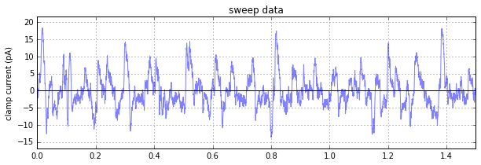
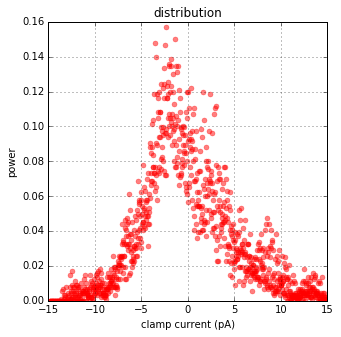
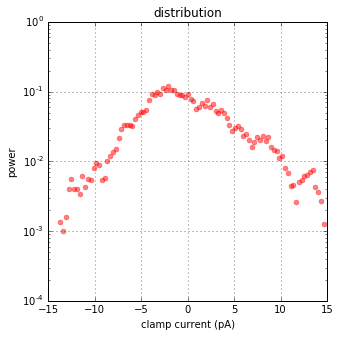

# Challenge
What is the best way to simultaneously quantify sEPSC and sIPSC influence from voltage-clamp recordings?

## Method 1: moving baseline derivative threshold detection
This method is used in [01.py](01.py)
* take a wide moving gaussian filter average of each trace and subtract it from the original data, centering the trace around 0pA.
* use a derivative method (dT of 2ms?) and capture all points which lie outside of a threshold (let's say 1 pA/ms)
* use the directionality of the derivative to define the "crossing" as an EPSC or IPSC

 | 
--- | ---

## Method 2: moving baseline derivative threshold detection
This method is used in [02.py](02.py). In this demo, the drug (2 minutes of drug between the vertical red lines) increases upward events (IPSCs) and tips the balance from excitation to inhibition, then recovers. It may be over-simplistic to turn a distribution into a single point. I wonder if there's a better way. When one considers the shape of EPSCs and IPSCs, it becomes obvious that trying to fit a gaussian curve is not the best solution. What about an average and stardard deviation? Sort of like a weighted average...

* take a wide moving gaussian filter average of each trace and subtract it from the original data, centering the trace around 0pA.
* create a 200-bin histogram of the points in the 2-second sweep and find its peak
 * if downward events dominate, the baseline average is pulled down, so the 0-centered line will "rest" slightly above 0pA. Therefore, the peak distribution will be slightly above 0pA, indicating net excitation. Call this value the 

### Result

### Sample Traces

baseline | drug
---|---
 | 
 | 
notice how the red line shifts _below_ 0pA | note how the red line shifts _above_ 0pA

## Point Distribution: _A Closer Inspection_
I'd want to (A) use information from the trace to determine what distribution of random samples (noise), (B) mathematically model the expected distribution of values due to this noise, and (C) subtract the noise distribution from real distribution to isolate the distribution of points mediated by a _biological_ cause. I would assume noise is random with a gaussian distribution. Creating the gaussian curve from this data is harder than you'd think though. You can't just fit it, or even just fit the center. It's not gaussian... anywhere... even in the middle. I can't fit this with confidence.  

Thoughts | Outcome
---|---
I start off with flat data centered at 0 |  
then I look at the distribution of all data points |   
taking fewer points doesn't help me any | 
and on a log scale it isn't really fitting anything either | 
It's definately changing its shape when drugs (which enhance spontaneous activity) go on. The wider and shorter it is, the more activity it has. It will always fit a gaussian, and if EPSCs and IPSCs increase similarly, the gassian center may or may not move. Actually, because EPSC and IPSC time dynamics differ, a doubling of frequency of both would probably cause the gaussian to shift toward the IPSCs since they are slower. This graph was made by [03b.py](03b.py) | 
