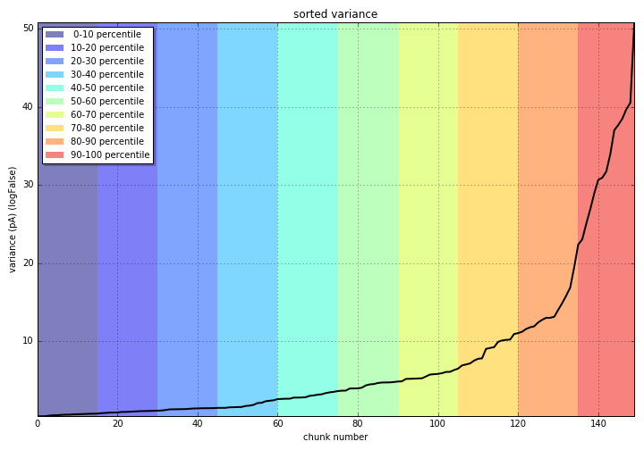
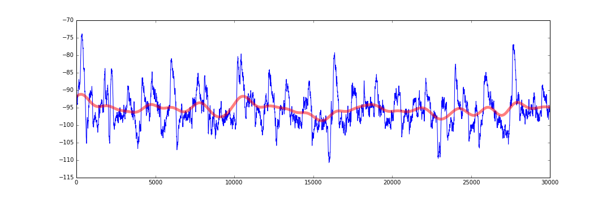
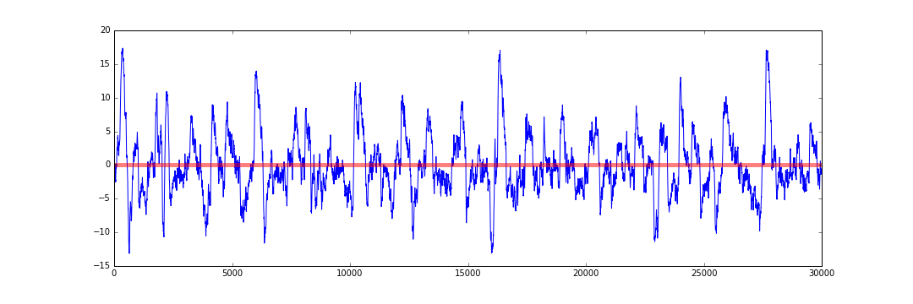
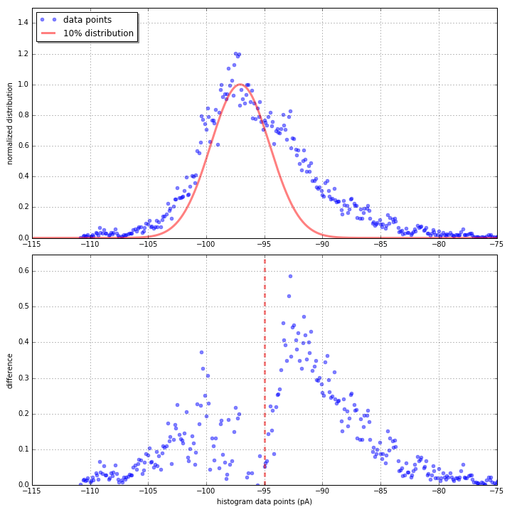
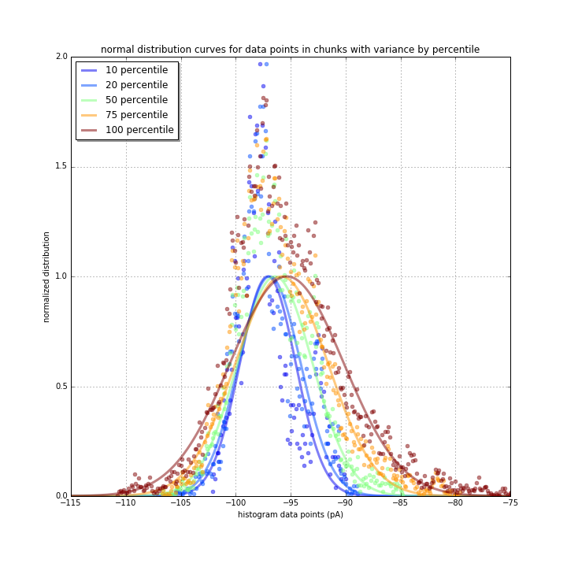
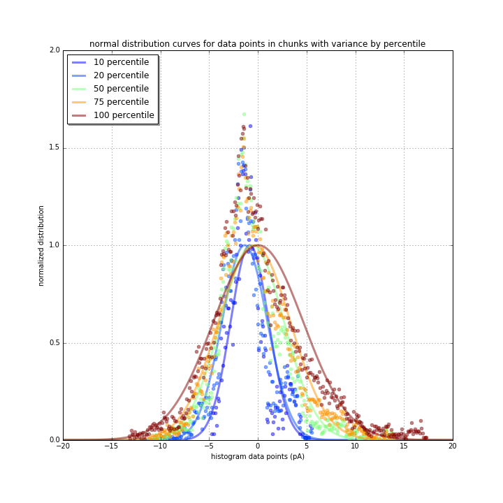
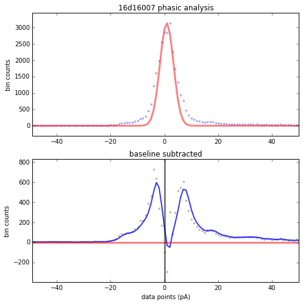

# Overview
Using voltage-clamp recordings where EPSCs and IPSCs go in different directions, find a way to separate and quantify the phasic current of these excitatory and inhibitory currents. Some of these currents are so small, they are near the noise floor. How do you pull them out of the noise floor? 

Problem|Solution
---|---
Previously noise has been estimated using a Gaussian fit of the center most data points then subtracted out. **Here, I present a better way to create a Gaussian curve of the noise floor** suitable for subtraction to isolate positive/negative phasic currents. It doesn't use curve fitting or convolution, so it's extremely fast computationally.|

## Programming Steps
_Consider starting after applying a tight moving window baseline subtraction to the sweep. Since we are measuring things <5 pA, a <5pA shift over the course of a sweep will influence all these results! I don't do this here, but definitely think about it._ **Update:** I tested this idea and confirmed it is very important. Results are at the bottom.

 - **Break the data** into "chunks" 10ms in length
 - **Measure the variance** of each chunk and isolate data only from the quietest chunks (where the chunk variance is in the lower 10-percentile of all the chunks)
 - **perform a histogram** on just the quiet data. The result will be assumed to be the noise floor, but requires creation of a curve.
	 - since the noise is random, we can expect a normal distribution. 
	 - This means no curve _fitting_ is required. We can generate this Gaussian curve because mu is the mean of the data, and sigma is the standard deviation of the data.
 - **Subtract** this histogram from the histogram of all the data. The difference will be phasic currents with noise removed, with inhibitory/excitatory currents on opposite sides of the mean.
 

 
# A Closer Look
These are graphs I made when first trying to figure out if this method will be viable, and if so how to configure it. The code to generate these graphs is in this folder, but is often way more complicated than it needs to be just to generate this data. All color coding is the same (blue is quiet, red is noisy).

## Isolating Quiet Data
Here are two views (standard and logarithmic) of 10 ms segments of data color-coded by their *percentile* variance.

Linear Variance | Logarathmic Variance
---|---
|
|

## Creating a Baseline Noise Curve
I rely on matplotlib's [normal point distribution function (PDF)](http://matplotlib.org/api/mlab_api.html#matplotlib.mlab.normpdf) function to create my gaussian curve. There are many scipy options for this, but let's not force our end user to use scipy. Assume that we have a histogram created where `data` is the bin count and `Xs` are the bin values. `HIST_RESOLUTION` is the histogram bin size.
```python
sigma=np.sqrt(np.var(data))
mean=np.average(data)
curve=mlab.normpdf(Xs,mean,sigma)
```
If you normalize to 1 this doesn't matter, but if you want to preserve the vertical scale of the curve also add:
```
curve*=len(data)*HIST_RESOLUTION # correct vertical scale
```

## Percentile Range Histograms
I found that there's little change in the curve below 20% even in noisy data like mine. It seems like a simple enough number. My rule from now on is to ***use the quietest 10% of a sweep to calculate the noise floor histogram***. Notice how the distribution curves begin to shift after you increase above 20% that value. 10% seems extremely safe. Regardless, it's _way_ better than attempting to fit a Gaussian curve to a bunch of missing data!

Percentile Histograms | Distribution Curves
---|---
|

Low Percentiles | Subtraction
---|---
|

## Smart Baseline Subtraction (bad idea)
**update:** It turns out that a moving baseline automatically centers the entire trace (and centers IPSCs) at 0. The "mode" isn't at 0, the "mean" is still at zero! This is a fail and will produce bad data. Don't "smart baseline" subtract after all.

_old text:_ Since our output measurements are "area under the curve" of slight deviations from the sweep mean, the sweep mean is extremely important! A slightly unstable baseline (even a few pA over a few seconds) will dramatically change these sums. Therefore, it is essentially mandatory that a moving baseline be subtracted before you can really rely on this data (this applies to _all_ phasic analysis, not just this method). The "bulge" to the right that we see on the graphs above is most likely due to an upward shift in the mean over the course of the sweep rather than true phasic deviations. 

Smart baseline subtraction (moving gaussian window with a 250ms width) was done with a single line:
```python
Y=Y-swhlab.common.lowpass(Y,POINTS_PER_MS*250)
```

Original Data | Moving Baseline Subtraction
---|---
|
|
|

## Eliminating Near-Mean Data (bad idea)
**update:** This was only necessary if you have over-sampled your histogram. I don't do this anymore, and this step is not needed. Just pull the generated baseline curve up to the peak of the histogram, and you're done.

_old text:_ At first I thought we should blank-out each side of the median by `np.var(data)` (the variance). On second thought, it seems like a bad idea to delete any data near the center of the histogram if the _amount_ of data varies as a function of data variance. A question remains of what to do with negative data. If negative data is really a problem, you could just delete points with negative data by `data[data<0]=np.nan` or something...

delete mean+/- variance (bad) | keep all data (better) | larger bins (best)
---|---
||
