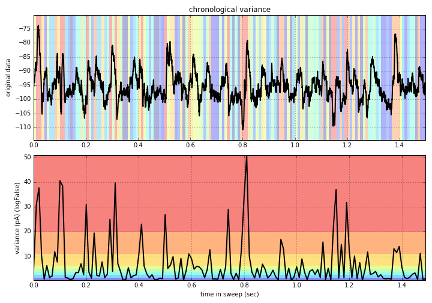
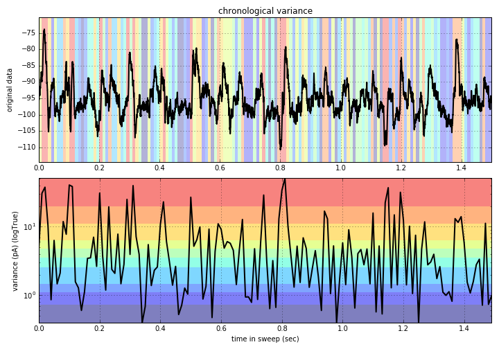
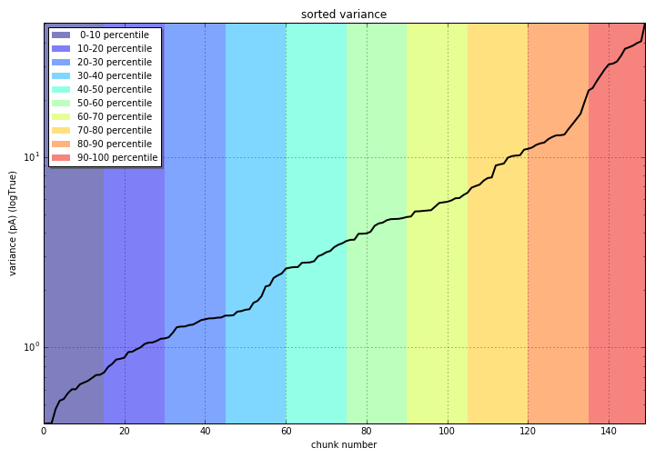
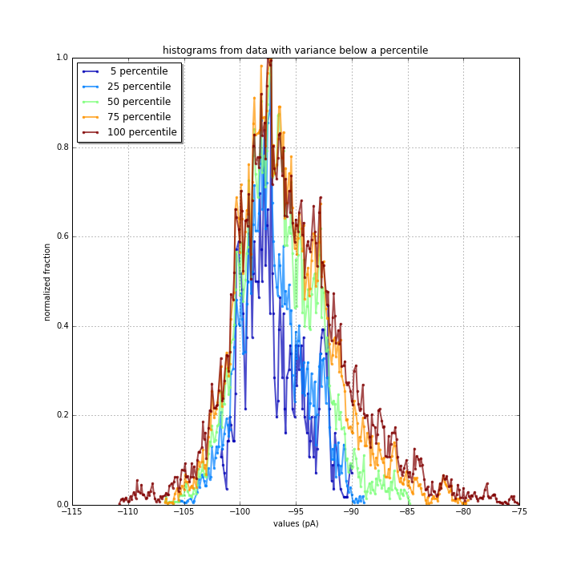
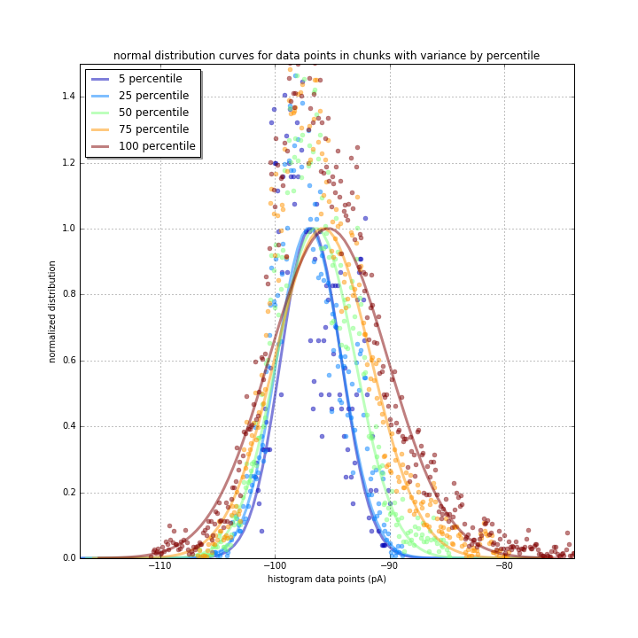

# Overview
Using voltage-clamp recordings where EPSCs and IPSCs go in different directions, find a way to separate and quantify the phasic current of these excitatory and inhibitory currents. Some of these currents are so small, they are near the noise floor. How do you pull them out of the noise floor? 

Problem|Solution
---|---
Previously noise has been estimated using a Gaussian fit of the center most data points then subtracted out. **Here, I present a better way to create a gaussian curve of the noise floor** suitable for subtraction to isolate positive/negative phasic currnents. It doesn't use curve fitting or convolution, so it's extremely fast computationally.|

 - **Break the data** into "chunks" 10ms in length
 - **Measure the variance** of each chunk and isolate data only from the quietest chunks (where the chunk variance is in the lower 10-percentile of all the chunks)
 - **perform a histogram** on just the quiet data. The result will be assumed to be the noise floor, but requires creation of a curve.
	 - since the noise is random, we can expect a normal distribution. 
	 - This means no curve _fitting_ is required. We can generate this gaussian curve because mu is the mean of the data, and sigma is the standard deviation of the data.
 - **Subtract** this histogram from the histogram of all the data. The difference will be phasic currents with noise removed, with inhibitory/excitatory currents on opposite sides of zero.

# A Closer Look
These are graphs I made when first trying to figure out if this method will be viable, and if so how to configure it. The code to generate these graphs will be linked where appropriate, but is often way more complicated than it needs to be just to generate this data.

## Isolating Quiet Data
Here are two views (standard and logarithmic) of 10 ms segments of data color-coded by their *percentile* variance.

Linear Variance | Logarathmic Variance
---|---
|
|

## Percentile Range Histograms
|
---|---
|
