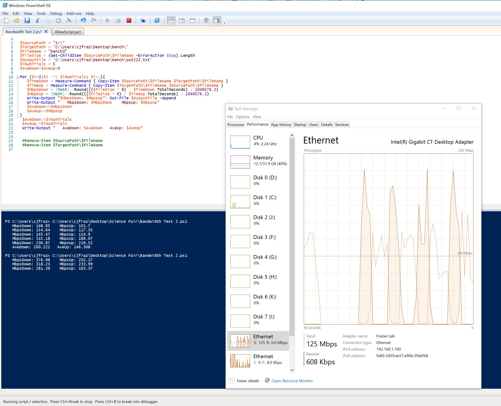

# X-Drive Stress Test
This script will stress the X-Drive in two ways:
* copying a 500MB file to the local computer
* manually seaching every folder in a large tree
Each will be done 5 times and the result averaged.
* now uses `xcopy` instead of `shutil.copy()`

## Demo Output
```
walking the entire tree of: X:\Data\DIC2\2014
(1/5) scanned 976 folders in 9.959 seconds
(2/5) scanned 976 folders in 8.234 seconds
(3/5) scanned 976 folders in 6.439 seconds
(4/5) scanned 976 folders in 5.795 seconds
(5/5) scanned 976 folders in 6.651 seconds
Average time for 5 runs: 7.416 seconds

copying a HUGE file: X:\...\2017-05-11 cell3_annotated.tif
(1/5) copy took 11.413 seconds (38.470 MB/s)
(2/5) copy took 12.155 seconds (36.122 MB/s)
(3/5) copy took 15.876 seconds (27.655 MB/s)
(4/5) copy took 25.751 seconds (17.050 MB/s)
(5/5) copy took 24.775 seconds (17.722 MB/s)
Average time for 5 runs: 17.994 seconds
```

# Powershell Script
Alternatively, copy/paste this text into the powershell:

```PowerShell
$SourcePath = "X:\"
$TargetPath = 'C:\'

For ($i=0; $i<100; $i++){
  Write-Output "Needs Work"
}
```


